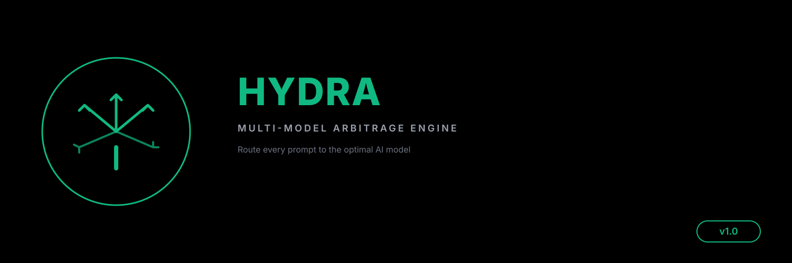

# Hydra

[](https://github.com/pkmdev-sec/hydra/actions/workflows/ci.yml)
[](LICENSE)
[](package.json)

Hydra sends one prompt to several LLM providers, compares the responses, estimates their cost, and records which models work best for each task type.

## What Hydra does

- Sends requests to Anthropic, OpenAI, and Google concurrently.
- Returns structured response, token, latency, and error data.
- Scores responses with deterministic quality heuristics.
- Calculates cost and identifies Pareto-optimal results.
- Stores learned model preferences by task type.
- Provides an optional Claude Code hook that logs a model recommendation.

The Claude Code hook does not dispatch requests or change the active model. Use the JavaScript API to send requests. Treat the hook output as a recommendation.

## Requirements

- Node.js 18 or newer
- Python 3.9 or newer for the optional hook
- Provider API keys for live model calls

Hydra has no npm dependencies.

## Install

```bash
git clone https://github.com/pkmdev-sec/hydra.git
cd hydra
npm test
```

Set only the keys for providers you plan to call:

```bash
export ANTHROPIC_API_KEY=...
export OPENAI_API_KEY=...
export GOOGLE_API_KEY=...
```

Do not commit API keys or place them in source files.

## Compare model responses

```javascript
import { sendToMultiple } from './lib/multi-sender.mjs';
import { rankResults } from './lib/quality-comparator.mjs';
import { findOptimal } from './lib/cost-optimizer.mjs';
import { LearningStore, learnFromResults } from './lib/learning-engine.mjs';

const { results } = await sendToMultiple(
  ['claude-sonnet-4-6', 'gpt-4o', 'gemini-2.0-flash'],
  'Explain quantum entanglement'
);

const ranked = rankResults(results, 'analysis');
const { recommended } = findOptimal(ranked, { minQuality: 60 });

const store = new LearningStore();
await store.load();
learnFromResults(store, 'Explain quantum entanglement', ranked);
await store.save();

console.log(recommended);
```

Provider model names and prices change. Review [`lib/multi-sender.mjs`](lib/multi-sender.mjs) and [`lib/cost-optimizer.mjs`](lib/cost-optimizer.mjs) before using Hydra for billing or production routing decisions.

## Use the recommendation hook

Add the hook explicitly to your Claude Code settings:

```json
{
  "hooks": {
    "PreToolUse": [
      {
        "matcher": "Bash|Agent|WebFetch",
        "hooks": [
          {
            "type": "command",
            "command": "python3 /absolute/path/to/hydra/hooks/hydra-router.py"
          }
        ]
      }
    ]
  }
}
```

The hook classifies supported tool inputs, writes recommendations to `~/.hydra/logs/routing.jsonl`, and exits without blocking the tool. See [the hook setup guide](docs/hook-setup.md).

## Modules

| Module | Purpose |
|---|---|
| [`multi-sender.mjs`](lib/multi-sender.mjs) | Provider requests, retries, timeouts, and circuit breakers |
| [`quality-comparator.mjs`](lib/quality-comparator.mjs) | Deterministic response metrics and ranking |
| [`cost-optimizer.mjs`](lib/cost-optimizer.mjs) | Cost estimates and Pareto analysis |
| [`learning-engine.mjs`](lib/learning-engine.mjs) | Task classification and stored preferences |
| [`hydra-router.py`](hooks/hydra-router.py) | Optional recommendation hook |

See [the architecture reference](docs/architecture.md) for the data flow and module contracts.

## Examples

```bash
node examples/compare-models.mjs
node examples/cost-optimize.mjs
```

The examples can make billable provider requests when API keys are present.

## Test

```bash
npm test
```

The test command runs the JavaScript suite and the Python hook suite.

## License

[MIT](LICENSE) © pkmdev-sec
